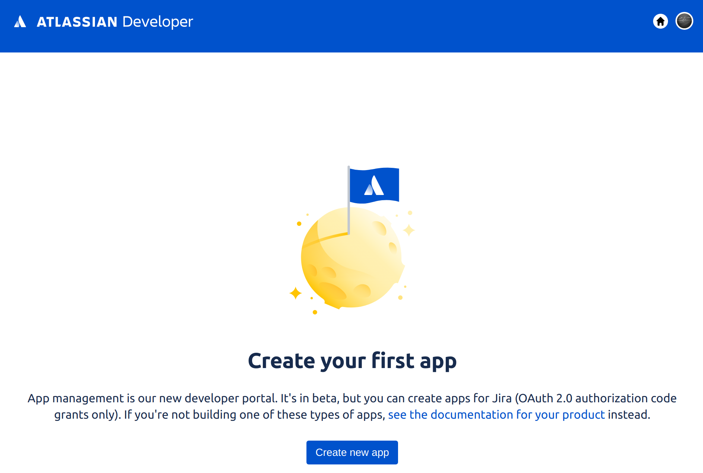
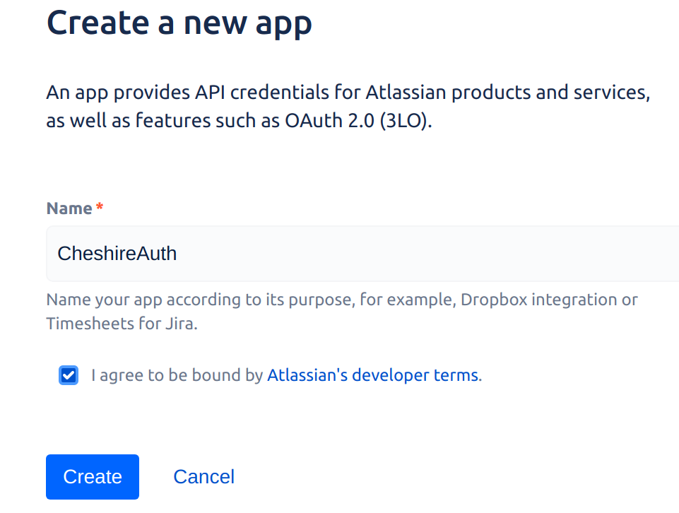
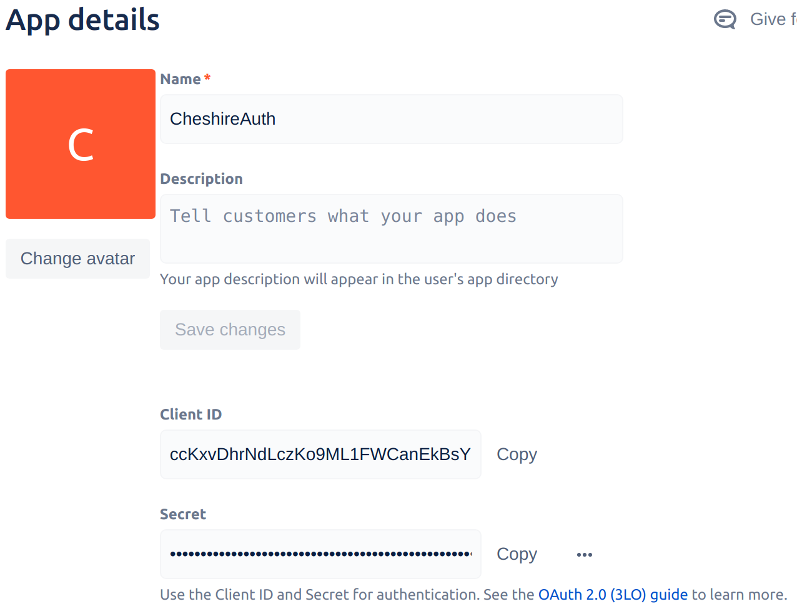
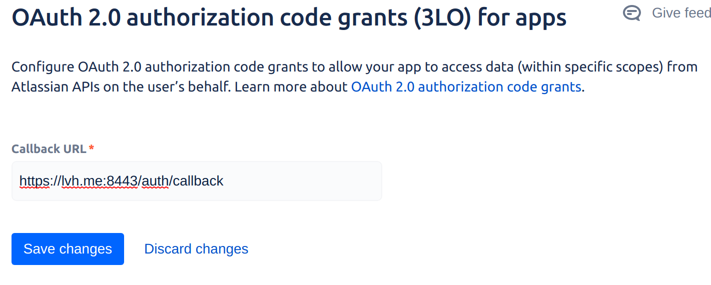

=========
Atlassian
=========

First, go to the `Atlassian Apps`__ management page. Click "Create new App":

.. __: https://developer.atlassian.com/apps/

Give your app a name, agree to terms, then click "Create":

On the app info page, copy out the client id and client secret. Then click
"OAuth 2.0 (3LO)" on the left panel.

Enter "https://lvh.me:443/auth/callback?provider=atlassian" in the field and
click "Save changes".

.. note::
   Like github, you can only enter one callback, so you'll need a separate app
   for testing purposes.

.. note::
   Atlassian will not allow you to register an `http://` URL... even for testing
   so you'll need something listening with https.

Documentation coming soon. See also `the atlassian page`__.

.. __: https://developer.atlassian.com/cloud/jira/platform/oauth-2-authorization-code-grants-3lo-for-apps/
