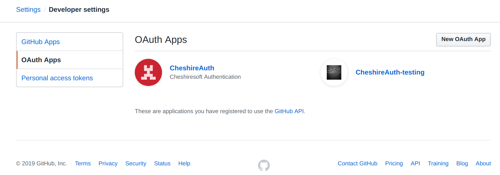
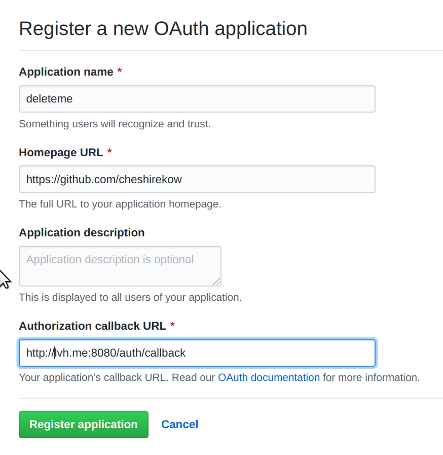
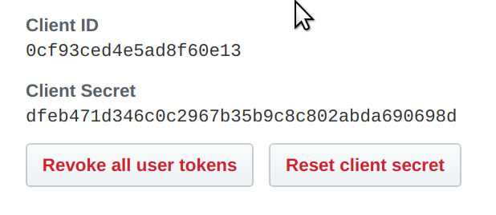

======
Github
======

Go to the Github `Developer Settings`_.

Click "New OAuth App". Fill out the form. Set the "Authorization Callback URL"
to::

    http://lvh.me:8080/auth/callback?provider=github

for testing, or your real server for deployment. Note that, unlike google,
we do not need to use the full exact URL (in particular, we can leave off
the ``?provider=`` bits.

.. warning::

   Github does not allow you to authorize multiple redirects for an application.
   If you wish to test multiple configurations, you will need to update the
   Authorized Callback URL each time, or register multiple applications.

Copy down the "Client ID" and "Client Secret" and add them to your
``config.py``.

.. _`Developer Settings`: https://github.com/settings/developers
