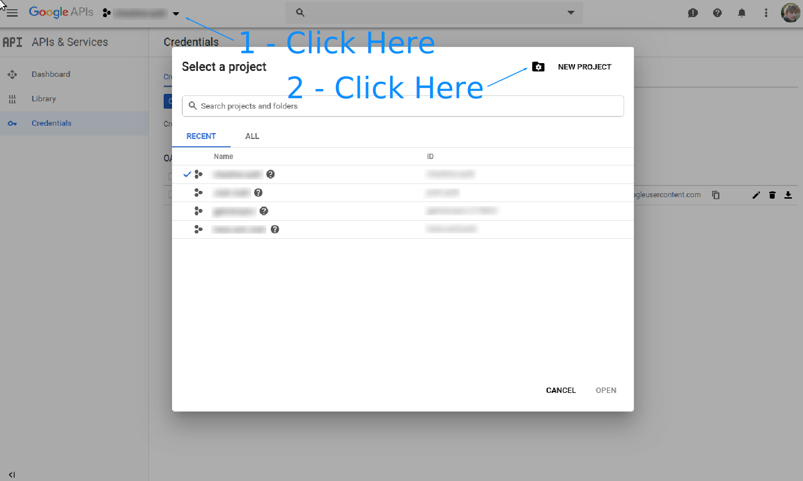
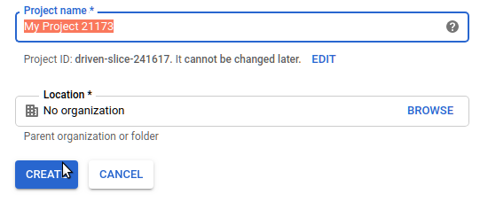
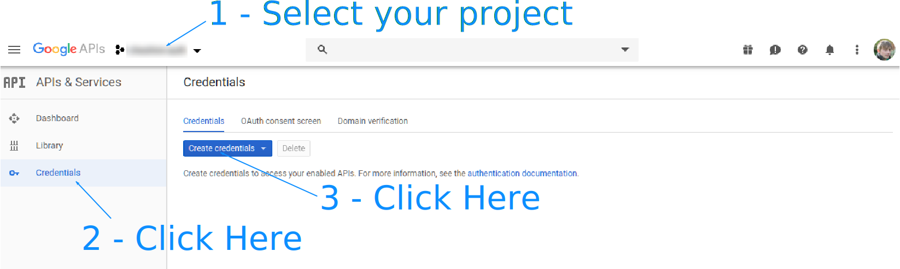
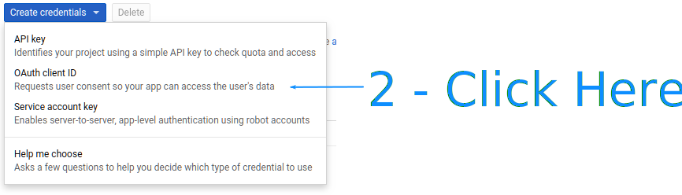
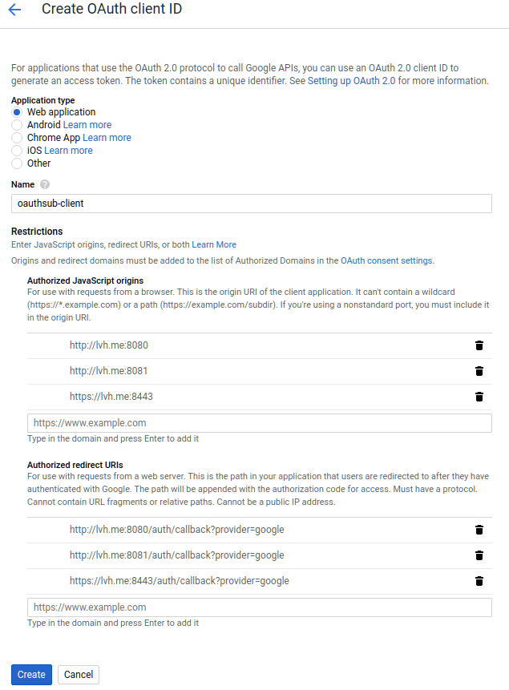
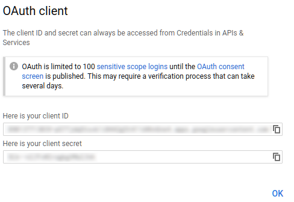
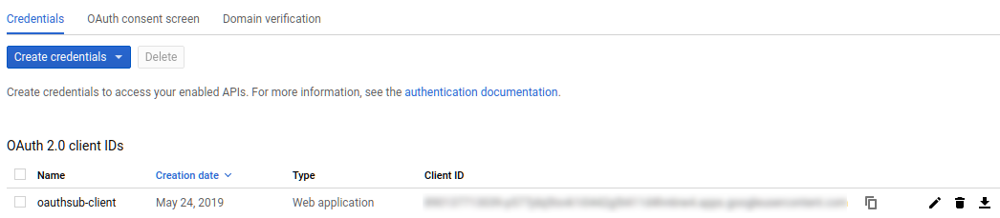

======
Google
======

Go to the Google `Developer Dashboard`_ and create a new project.

Give it a name.

Select the project in the top left next to the GoogleAPIs logo.
Click "Credentials" under the menu on the left of the screen.

Click "Create credentials":

Select "Web Application". Give it a name. Then fill in the Javascript origins:

* http://lvh.me:8080/
* http://lvh.me:8081/
* https://lvh.me:8443/

and authorized redirects:

* http://lvh.me:8080/auth/callback?provider=google
* http://lvh.me:8081/auth/callback?provider=google
* https://lvh.me:8443/auth/callback?provider=google

Then click "create" and copy out the client id and secret from the popup.

The client id is also available on the dashboard after you create it:

.. note::

   We add three authorized domains for different testing scenarios. The 8081
   port will be the raw service. 8080 will be an nginx reverse proxy listening
   over unencrypted http. 8443 will be an nginx reverse proxy listening over
   encrypted https (with a self-signed certificate).

.. note::

   As of January 2019 Google has recently changed their developer
   settings and requirements for OAUTH access. They used to allow `localhost`
   and now they do not. An alternative is to use `lvh.me` which currently
   resolves through DNS to 127.0.0.1. Be careful, however, as this is a
   common solution cited on the interwebs but no one seems to know who
   controls this domain and they may be nefarious actors.

For deployment you'll want to add a redirect like this::

    https://server.yoursite.com/auth/callback?provider=google

.. _`Developer Dashboard`: https://console.developers.google.com/apis/credentials
