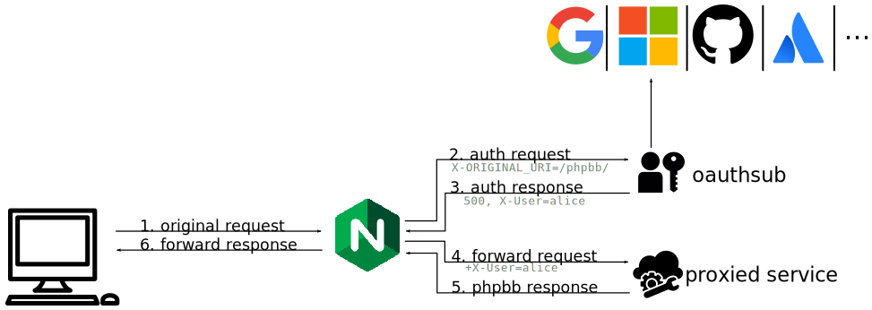

========
Examples
========

This section will demonstrate how to use ``oauthsub`` to secure various
services behind NGINX as a reverse proxy, with authentication provided by
one of many popular providers. The basic setup for each service is shown
in figure :numref:`small-flow`.

.. _small-flow:

   The basic authentication setup.

Before proceeding with these examples, you'll need to setup at least one
``oauth2`` provider. See the tutorials below on how to do that.
Then you can create a basic nginx configuration before finally configuring
your backend service integration.

.. toctree::

   providers
   nginx
   gerrit
   buildbot
   phpbb
   jenkins
   nexus
   discourse
