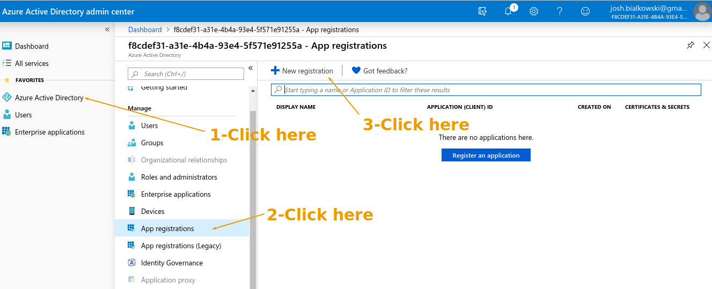
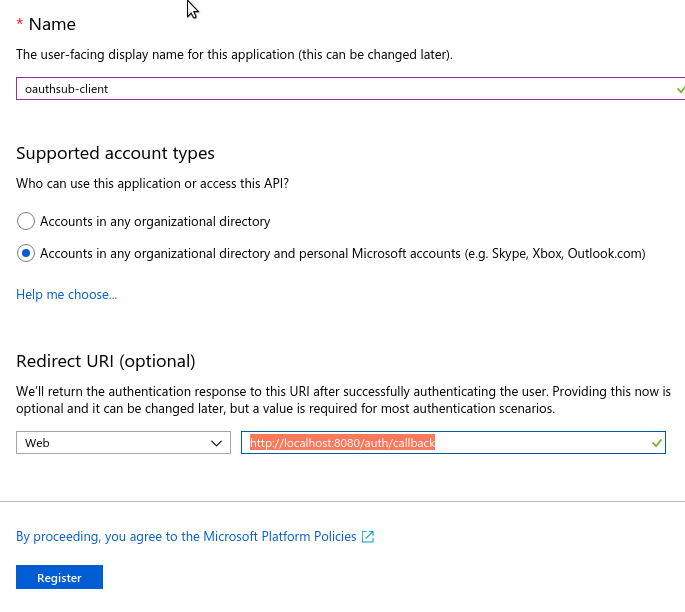
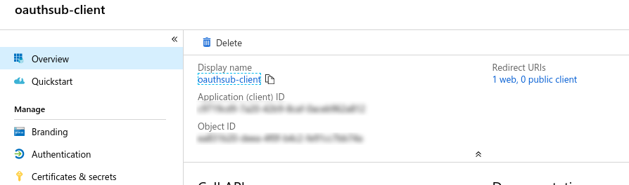
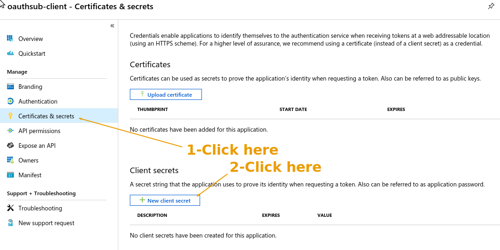
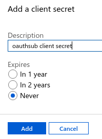
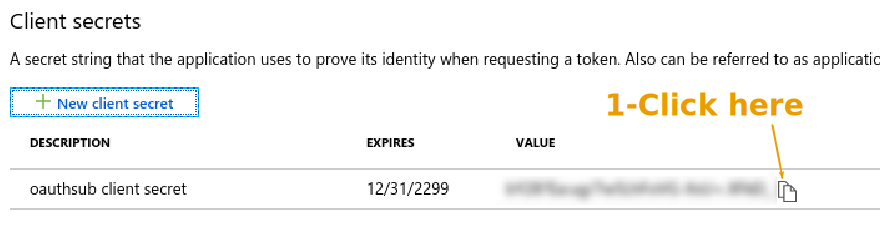

=========
Microsoft
=========

Go to the `Azure Active Directory`__ admin center.

.. __: https://aad.portal.azure.com/

Click "Azure Active Directory" on the left, and then "App registrations".
On the top of the page click "New registration".

Give it a name and set the redirect uri to
"http://localhost:8080/auth/callback". Then click "Register" at the bottom.

.. note::

   Microsoft does not allow ``http://`` for anything other than localhost, so
   we can't use ``http://lvh.me:8080`` like we can with the other providers.

On the next page copy off the "Application (client) ID".

Then click "Certificates & secrets" and click "New client secret".

Give it a name, set an expiration, then click "Add".

Then copy the newly created client secret.

